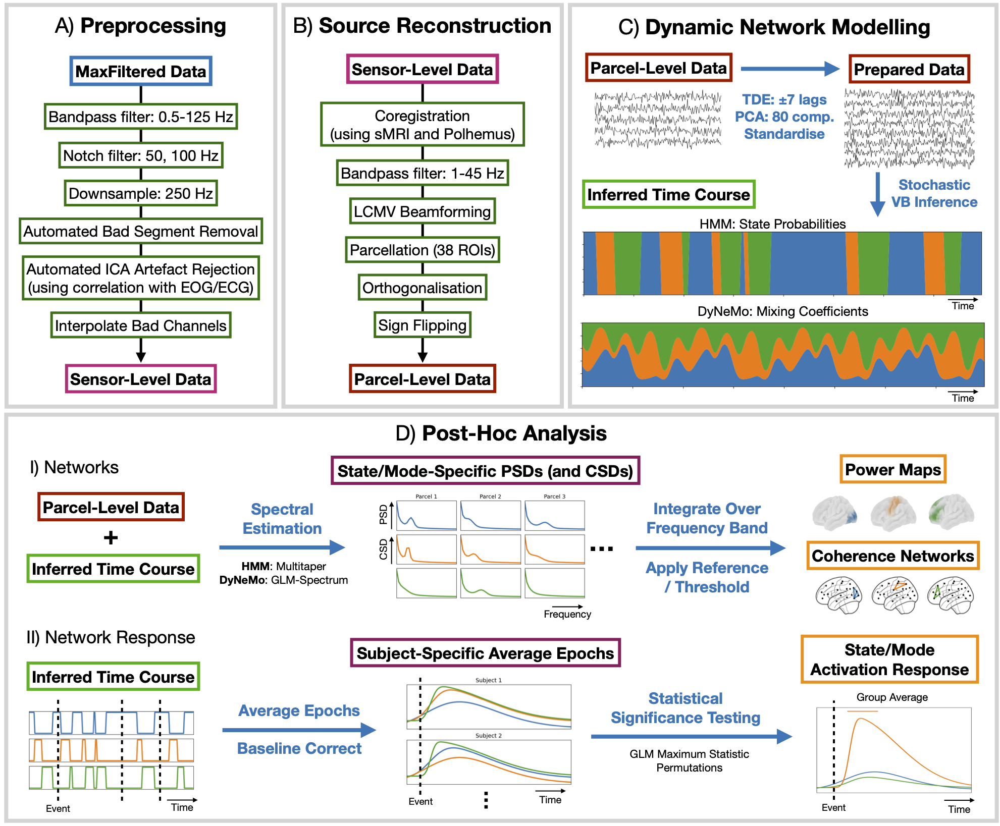

# Dynamic Network Analysis of Electrophysiological Task Data

Example scripts for reproducing the results in [Gohil et al. (2024)](https://www.biorxiv.org/content/10.1101/2024.01.12.567026v2). If you find these scripts useful, please cite:

> Gohil, C., et al. "Dynamic Network Analysis of Electrophysiological Task Data." _bioRxiv_ (2024): 2024-01.

## Pipeline Overview

## Directories

- `1_preproc_and_source_recon`: Preprocessing for the sensor-level MEG data and source reconstruction to estimate parcel time courses. 
- `2_conventional_sensor_level_analysis`: Conventional time-frequency response analysis applied to the preprocessed sensor-level data.
- `3_conventional_parcel_level_analysis`: Conventional time-frequency response analysis applied to the parcel data.
- `4_hmm_network_analysis`: HMM network inference applied to the parcel data and network response analysis.
- `5_dynemo_network_analysis`: DyNeMo network inference applied to the parcel data and network response analysis.

## Prerequisites

To run these scripts you need to install [OSL](https://github.com/OHBA-analysis/osl) and [osl-dynamics](https://github.com/OHBA-analysis/osl-dynamics). See the instructions [here](https://osl.readthedocs.io/en/latest/install.html) to install these packages.

## Getting help

You can email chetan.gohil@psych.ox.ac.uk if you run into errors, need help or spot any typos. Alternatively, please open an issue on this repository.
