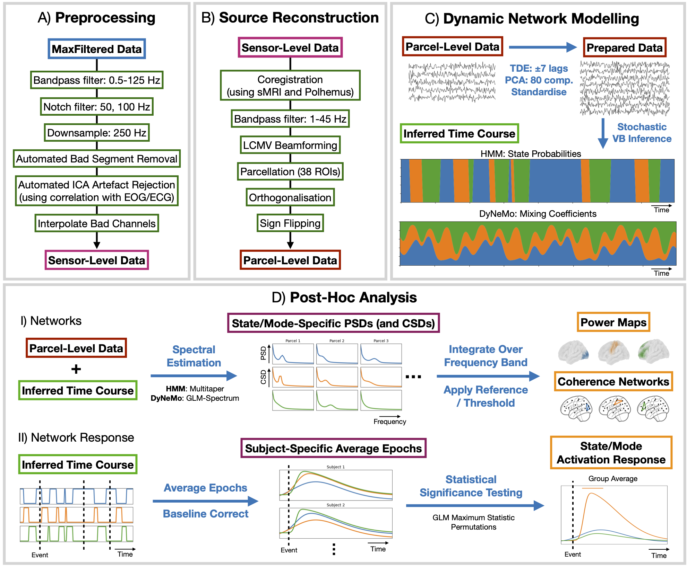

# Dynamic Network Analysis of Electrophysiological Task Data

Example scripts for reproducing the results in [Gohil et al. (2024)](https://direct.mit.edu/imag/article/doi/10.1162/imag_a_00226/123273/Dynamic-network-analysis-of-electrophysiological). If you find these scripts useful, please cite:

> Gohil, C., Kohl, O., Huang, R., van Es, M. W., Parker Jones, O., Hunt, L. T., ... & Woolrich, M. W. (2024). Dynamic network analysis of electrophysiological task data. Imaging Neuroscience, 2, 1-19.

## Pipeline Overview

## Directories

- `1_preproc_and_source_recon`: Preprocessing for the sensor-level MEG data and source reconstruction to estimate parcel time courses. 
- `2_conventional_sensor_level_analysis`: Conventional time-frequency response analysis applied to the preprocessed sensor-level data.
- `3_conventional_parcel_level_analysis`: Conventional time-frequency response analysis applied to the parcel data.
- `4_hmm_network_analysis`: HMM network inference applied to the parcel data and network response analysis.
- `5_dynemo_network_analysis`: DyNeMo network inference applied to the parcel data and network response analysis.

## Prerequisites

To run these scripts you need to install [osl-dynamics](https://github.com/OHBA-analysis/osl-dynamics) and [FSL](https://fsl.fmrib.ox.ac.uk/fsl/docs/).

## Getting help

You can email chetan.gohil@psych.ox.ac.uk if you run into errors, need help or spot any typos. Alternatively, please open an issue on this repository.
